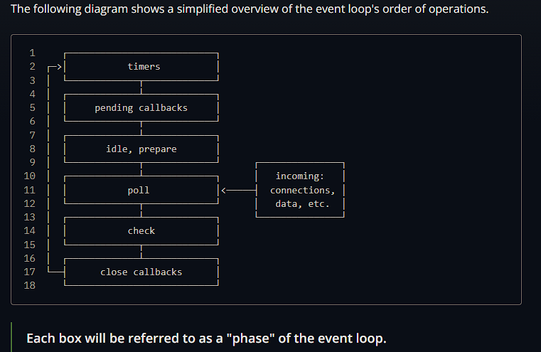

# Event Loop
( It's a piece of code that lives in libuv that process async code and events. )  
The event loop is what allows NodeJS to run asynchrounus I/O operations despite the fact that javascript is a single threaded language -- by offloading operations to the system kernel whenver possible.  

Since most modern kernels are multi-threaded, they can handle multiple operations executing in the background. When one of these operations completes, the kernel tells Node.js so that the appropriate callback may be added to the poll queue to eventually be executed 

## Phases of Event Loop 

+ timers: this phase executes callbacks scheduled by setTimeout() and setInterval().
+ pending callbacks: executes I/O callbacks deferred to the next loop iteration.
+ idle, prepare: only used internally.
+ poll: retrieve new I/O events; execute I/O related callbacks (almost all with the exception of close callbacks, the ones scheduled by timers, and + setImmediate()); node will block here when appropriate.
+ check: setImmediate() callbacks are invoked here.
+ close callbacks: some close callbacks, closing open connections e.g. socket.on('close', ...).