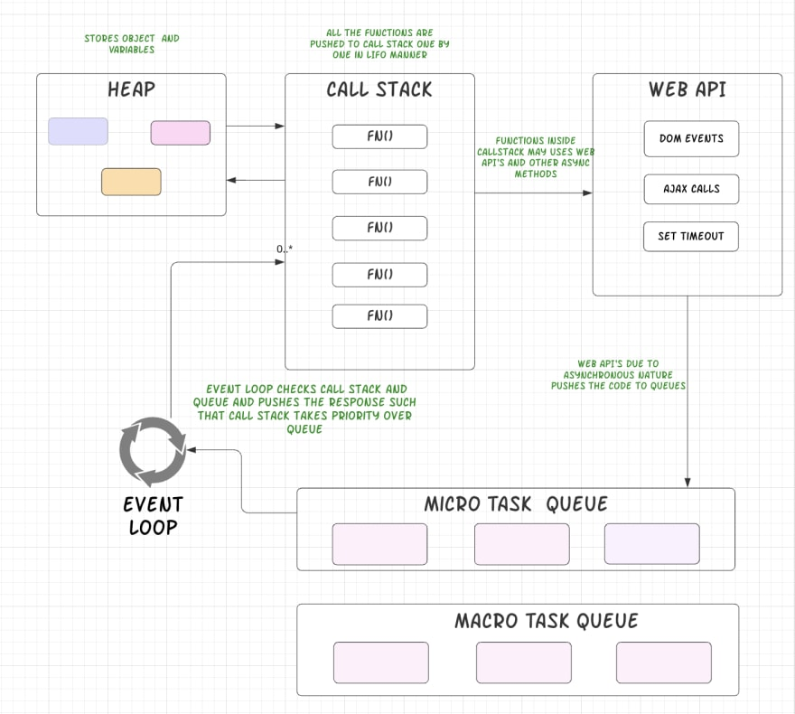

# Event Loop

The concept of event loop is very simple. Event loop is an endless or continous loop which checks the if the call stack also called as the main execution context is empty, if it is empty event loop checks the macrotask queue and the microtask queue for tasks waiting to be executed and then the event loop will dequeue the tasks one by one.

    Tasks that should be executed immediately like promise callbacks or api requests are put in the microtask queue. Microtask queue has a higher priority over the macrotask queue 

Example :- 
```js
setTimeout(() => console.log(1), 0);

console.log(2);

new Promise(res => {
  console.log(3)
  res();
}).then(() => console.log(4));

console.log(5);


// Output is as follows :- 
// 2
// 3
// 5
// 4
// 1
```
Explaination :-
1. The main() execution context is pushed to the call stack.
2. setTimeout is encountered which falls in the category of marcotask queue, hence the setTimeout callback is put in the macrotask queue also refered to as the task queue.
3. console.log() is executed immediately <mark> // 2</mark>.
4. Promise is encountered it falls in the categoy of microtasks, hence the Promise executor function <mark>res => {
  console.log(3)
  res();
}</mark> is put in the microtask queue. The callback function is executed synchronously i.e first console.log is executed and then the res() function. <mark> // 3
5. console.log() is executed immediately <mark> // 5 
6. Now since the call stack is empty, the promise cb will be first executed <mark> // 4
6. There's no tasks remaining to be executed in microstask queue, event loop will pick from the macrotask queue and exected the setTimeout callback. <mark> // 1    