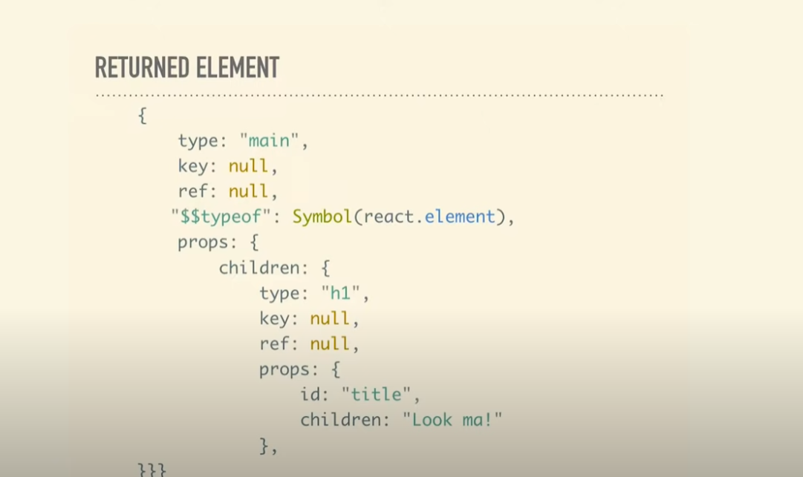

# Virtual DOM 
Virtual DOM is an in-memory representation  of the the actual DOM, which is   always kept in sync with the real DOM using a process called reconciliation. This is what makes react use a declarable approach that is we tell react what state the UI should be in and it makes sure the DOM matches that state. 

    Virtual DOM is a javascript object stored in memory. It is a much lighter replica  of the real DOM. 
    Could also be called as giant tree of objects, where each node is refeered to as a Fiber node. In a fiber node each object will have a type property, for HTML elements the value of type property will be a string, for React Components the value of type property will be a Function. As said DOM elements will have their type as string and react will know to convert them into DOM elements directly. 
    
    When React gets a command to mount the app (initial render), it iterates over that tree and does the following:

    If the "type" is a string, it generates the HTML element of that type.
    If the "type" is a function (i.e., our component), it calls it and iterates over the tree that this function returned.


```js
// An object in Virtual DOM would look like this

const Form = () => {
    return (
        <form>
            <Checkbox />
            <Input />
        </form>
    )
}

// Fiber node
{
    type : "form",
    props : {
        children : [
            {
                type : Checkbox,
                key : null,
                ref : null,
                props : {
                    children : [

                    ]
                }, 
                ...
            },
            {
                type : Input,
                props : {
                    chilren : [

                    ]
                }
            }
        ]
    }
}
```

# Reconciliation and Diffing 
Reconciliation is an algortithm used by react to diff between 2 trees to determie what parts needs to be changed. This process is kicked off by the render function from react-DOM library, when we render a react application, it generates a tree of nodes which describes the app and it is saved in memory also known as Virtual DOM. When an app is updated usually via useState, it generates a new tree. This tree is then diffed with the previous tree to compute which operations needed to be performed to get the latest UI. 

Here's a deeper look into reconciliation:

+ Diffing: At the heart of reconciliation is a process called diffing. React compares the new VDOM tree with the previous VDOM tree to identify the specific parts that have changed. This diffing algorithm is optimized to find the most efficient way to update the real DOM, minimizing unnecessary manipulations.

+ Minimal Updates: Based on the diffing results, React updates only the minimal portions of the real DOM that require changes. This avoids the expensive operation of rewriting the entire DOM tree for small UI updates.

# React Fiber
Fiber was introduced in React 16, before this there was stack reconciler. As the name suggest the algorithm uses stack data structure and it works just like a stack, we can remove or add items but it needs to work until stack is empty. React fiber allows us to :- 

+ pause work and come back to it later.
+ assign priority to different types of work.
+ reuse previously completed work.
+  abort work if it's no longer needed.


React fiber is a complete rewrite of react reconciler that fixes a few long-standing issues and offers incredible and offers opportunities heading into the future. 
+ React Fiber uses a data structure called a "fiber" which represents a unit of work in the UI update process.
These fibers form a tree structure mirroring the component hierarchy.
+ The reconciler can now break down the rendering work into smaller chunks associated with individual fibers.

Benefits of React Fiber:

+ Incremental Rendering: React Fiber can split rendering work into smaller pieces and spread it out over multiple browser frames. This allows the browser to attend to other tasks like user interaction while still making progress on the UI update. This leads to a smoother and more responsive user experience.
+ Prioritization: Different types of updates can be assigned priorities. For example, user interactions like button clicks might have higher priority than updating a long list of items. This ensures that critical updates are handled first, maintaining a smooth user experience.
+ Pausable and Restartable: With React Fiber, the reconciler can pause or restart rendering work as needed. If a new update comes in while processing the current one, React can pause the current work, integrate the new update, and potentially restart the rendering process from the beginning for better efficiency.
+ Improved Error Handling: React Fiber allows for better isolation of errors within specific components. This makes debugging and fixing issues in complex applications easier.

