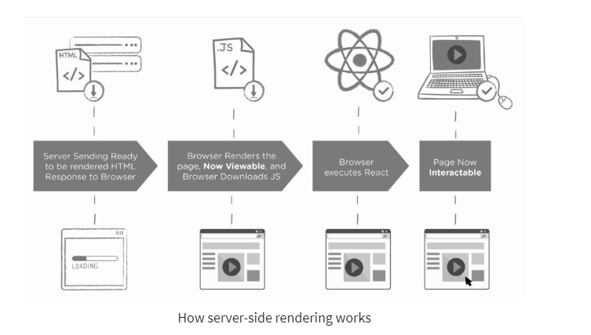

# Server Side Rendering (SSR)
Server Side rendering is exactly what it sounds like rendering on the server, i.e client/user will request for a webpage, server recieves the requests and generates the requested webpage with all the neccessary information that user needs to see and then sends it to client. Now client does not need to wait for any CSS and javascript to load. 
+ SSR can greatly improve performance as it allows us to render HTML documnets before sending it to client
+ It also reduces page load time and improves SEO by sending the page's content earlier than if you were to send it after the page has loaded.

Benefits of Server-Side Rendering
Some advantages of server-side rendering include:

+ Faster load time. A server-side rendered application speeds up page loading when the user suffers from a slow internet connection. Thus it greatly improves the whole user experience.

+ Easy indexation by search engines. As the content can be rendered before the page is loaded when rendering server-side, search engines can easily index and crawl it.

+ There are fewer issues with social media indexing. Social media crawlers, like search engine bots, have difficulty indexing JavaScript content. Client-side rendering is not supported by Facebook's Open Graph Protocol or Twitter Cards, for example. If social media sharing is an important part of your marketing strategy, server-side rendering may be a better option.

+ Better in terms of accessibility. SSR apps are better suited for people who use older devices with less powerful CPUs because the server sends pre-rendered content to the browser. Because assistive technologies such as screen readers cannot always parse client-side JavaScript, server-side rendering is frequently recommended for SPA accessibility. So, server-side rendering helps efficiently load web pages for users with slow Internet connections or outdated devices.

# Client Side Rendering (CSR)
This rendering pattern is used by Javascript frameworks like react to build Single Page Applications (SPA). Initially server sends a blank HTML page to client which is the first rendering paint. After when all js execution is finished then rendering of the rest of HTML happens 